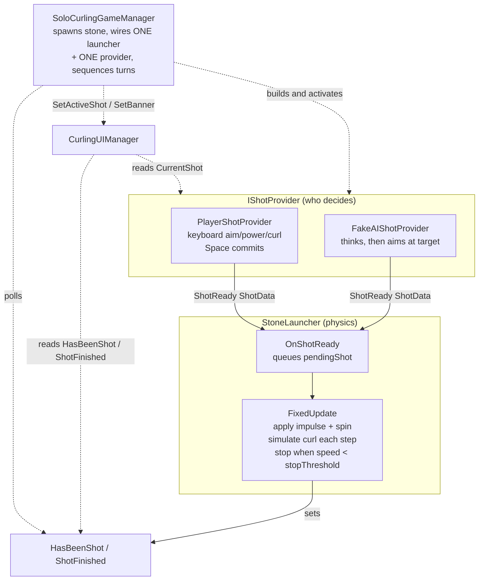

# CurlingRoundScript — Architecture Overview

This folder holds the scripts that drive a solo curling round: aiming and throwing a
stone, its sliding/curl physics, turn sequencing, and the on-screen HUD.

The defining idea of this branch (`feature/stone-lauch-abstracted`) is that **a throw is
decoupled from who decides it**. The old monolithic `CurlingStoneController` has been split
into three pieces connected by a single event, so the human player and an AI can drive the
*exact same* launcher without it knowing which is which.

---

## The shot abstraction (the heart of the branch)

A throw is split along one clean seam:

| Concern | Type | Role |
| --- | --- | --- |
| **Who decides a shot** | [`IShotProvider`](Shooting/IShotProvider.cs) implementations | Compose a shot, then announce it |
| **The shot itself** | [`ShotData`](Shooting/ShotData.cs) | Immutable value describing one throw |
| **What the stone does with it** | [`StoneLauncher`](Shooting/StoneLauncher.cs) | Applies physics — nothing else |

### The seam: `IShotProvider`

```csharp
event Action<ShotData> ShotReady;   // raised exactly ONCE when the shot is committed
ShotData CurrentShot { get; }       // the live, in-progress shot — for HUD preview
void Rearm();                       // re-arm to accept a fresh shot on reset
```

A provider spends several frames (human) or a "thinking" delay (AI) building a shot, then
raises `ShotReady` once. `StoneLauncher` subscribes and executes it. Crucially, the launcher
stores its provider as a plain `MonoBehaviour shotProviderSource` and casts it to
`IShotProvider` at runtime — so **the launcher never names a concrete provider type**, and any
provider can be wired in from the inspector (or added at runtime).

### `ShotData`

An immutable `readonly struct` — the only thing that ever crosses the seam:

- `Direction` — normalized world-space aim (the constructor normalizes defensively, falling
  back to `Vector3.forward` for a near-zero vector, so callers can pass a raw
  `target − position`).
- `Power` — launch impulse magnitude.
- `Curl` — signed: **negative = curl left, positive = curl right** relative to travel.

---

## Control flow



**In one sentence:** a provider raises `ShotReady(ShotData)` → `StoneLauncher.OnShotReady`
queues it → the next `FixedUpdate` applies the impulse + pre-shot spin, then bends the
velocity heading a little each physics step (the curl) until speed drops below
`stopThreshold`, flipping `ShotFinished` to true.

---

## Directory map

```
CurlingRoundScript/
├── Shooting/                     ← the new shot abstraction
│   ├── ShotData.cs               immutable description of one throw
│   ├── IShotProvider.cs          seam: ShotReady / CurrentShot / Rearm
│   ├── PlayerShotProvider.cs     human input half (keyboard → ShotData)
│   └── StoneLauncher.cs          physics half (ShotData → impulse, curl, stop)
├── AIShotProviderTemp/           ← throwaway demo, meant to be replaced
│   └── FakeAIShotProvider.cs     a dumb AI proving the seam works
├── SoloCurlingGameManager.cs     orchestrator: modes, spawning, turn sequencing, scoring
├── CurlingUIManager.cs           single HUD authority (TextMeshPro)
├── CameraSwitcher.cs             independent: cycle cameras with Tab
└── PlayerTagAssigner.cs          independent: assign a tag in edit/play mode
```

---

## Per-script responsibilities

### The shooting seam (`Shooting/` + `AIShotProviderTemp/`)

**[`ShotData`](Shooting/ShotData.cs)** — immutable `readonly struct` (Direction, Power,
Curl). Pure data, source-agnostic; produced by any provider, consumed by the launcher and
read by the HUD. Depends on nothing but `UnityEngine`.

**[`IShotProvider`](Shooting/IShotProvider.cs)** — the interface every shot source implements:
the `ShotReady` event, the `CurrentShot` preview getter, and `Rearm()`. This is the only thing
`StoneLauncher` and `CurlingUIManager` know about a shot source.

**[`PlayerShotProvider`](Shooting/PlayerShotProvider.cs)** — the human input half
(`MonoBehaviour, IShotProvider`). Each `Update` reads the keyboard (← → aim, ↑ ↓ power, Q/E
curl) and updates the aim-preview arrow; **Space** commits the shot via `CommitShot()`, which
raises `ShotReady`. An `armed` flag flips off the instant Space is pressed so a shot can't fire
twice until `Rearm()`. Knows nothing about physics.

**[`FakeAIShotProvider`](AIShotProviderTemp/FakeAIShotProvider.cs)** — a **temporary,
throwaway** demo (`MonoBehaviour, IShotProvider`), explicitly *not* the real `AIStoneController`
(which lives outside this folder and is untouched). `OnEnable` starts the `ThinkThenShoot()`
coroutine — the manager only activates the stone on the AI's turn, so enabling *is* the cue to
start deliberating. After `thinkDelaySeconds` it aims flat at its `target` (the house center),
applies a configurable, optionally jittered power/curl, and raises `ShotReady`. Its whole point
is to prove a non-human source drops into the same launcher with zero launcher changes.

**[`StoneLauncher`](Shooting/StoneLauncher.cs)** — the physics half
(`[RequireComponent(typeof(Rigidbody))]`). In `OnEnable` it casts `shotProviderSource` to
`IShotProvider` (logging an error if the cast fails) and subscribes to `ShotReady`;
`OnDisable` unsubscribes. `OnShotReady` stashes the shot and defers it to `FixedUpdate`, where
the impulse and one-shot spin are applied and then curl is simulated until the stone stops.
Exposes `HasBeenShot` / `ShotFinished` (polled by the manager and UI) and `ResetStone()`,
which restores the start pose and calls `provider?.Rearm()`.

### Orchestration & UI

**[`SoloCurlingGameManager`](SoloCurlingGameManager.cs)** — the orchestrator, with two modes
(`GameMode { TestDrop, Match }`):

- **TestDrop** (original showcase): spawns `enemyStoneCount` enemy stones at random
  non-overlapping positions around the house; the player throws the single pre-placed scene
  stone; `ComputeScore()` gives +1 if the player is closest, else −1 per closer enemy. **R**
  resets.
- **Match** (temp turn-based round): the pre-placed stone is disabled and *every* stone is
  spawned at runtime. `RunMatch()` loops → `RunTurn(isAI)` per throw (`i % 2 == 0` is the AI,
  so the **AI throws first**), `stonesPerSide * 2` throws total → `ComputeMatchResult()`
  (standard curling end scoring, excluding stones that fell off the sheet) → banner → **R** to
  replay.

  The abstraction is assembled in **`SpawnThrower`**: instantiate the prefab *inactive*, run
  `StripShotComponents` (a `DestroyImmediate` guard so a prefab that already carries shot
  scripts can't end up with two launcher/provider pairs and a **double-strength impulse**),
  `AddComponent<StoneLauncher>()`, copy physics tuning from the scene `stone`, add either a
  `FakeAIShotProvider` or a `PlayerShotProvider`, assign `launcher.shotProviderSource`, point
  the UI, then `SetActive(true)` — so `Awake`/`OnEnable` run with everything already wired.

  Recovery: **N** (`forceNextTurnKey`) force-skips a stuck turn; `FixedUpdate` freezes stones
  that fall below `killY` and snaps slow creepers to a stop.

**[`CurlingUIManager`](CurlingUIManager.cs)** — the single HUD authority, rendering both modes
through one `TMP_Text infoText`. It's driven by an "active shot" (a `StoneLauncher` + optional
`PlayerShotProvider`) plus an optional banner line. `Update` picks the state from
`HasBeenShot`/`ShotFinished`: live aiming HUD (power/curl bar/aim, read from
`provider.CurrentShot` and `provider.maxCurlPower`), "stone is sliding", a banner, or the
test-mode result panel. `SetActiveShot(stone, provider)` reassigns it each turn — a **null
provider suppresses the aiming HUD** (used on AI turns); `SetBanner`/`ClearBanner` drive the
banner line.

### Independent utilities

**[`CameraSwitcher`](CameraSwitcher.cs)** — cycles a `Camera[]` with **Tab** (configurable
`switchKey`), enabling one at a time. Also exposes `SwitchTo(int)` for other scripts. No
dependency on the shot system.

**[`PlayerTagAssigner`](PlayerTagAssigner.cs)** — `[ExecuteAlways]` helper that assigns a
configurable `playerTag` to its GameObject in both edit and play mode (via `OnValidate`,
`OnEnable`, `Awake`), warning once if the tag isn't defined. Unrelated to the shot flow.

---

## How a turn plays out (Match mode)

1. `RunMatch()` clears the sheet and loops `stonesPerSide * 2` turns.
2. `RunTurn(isAI)` calls `SpawnThrower`, which builds a stone carrying **exactly one**
   `StoneLauncher` + one provider, wired *before* the object is activated.
3. It waits until `launcher.HasBeenShot` (the provider raised `ShotReady`) — or a forced skip.
4. Then it waits until `launcher.ShotFinished && AllMatchStonesSettled()` (with a 20 s safety
   timeout and the force-skip escape).
5. The stone is filed into `aiStones` or `playerStones` by side.
6. After all throws, `ComputeMatchResult()` scores the end, pushes the result to the UI
   banner, and waits for **R** to replay.

---

## Patterns & conventions

- **The seam is a C# `event Action<ShotData>`**, not a `UnityEvent` — providers announce, the
  launcher listens.
- **Interface polymorphism via `shotProviderSource as IShotProvider`** — the launcher is wired
  to a `MonoBehaviour` and never names a concrete provider.
- **Polling of public getters** (`HasBeenShot`, `ShotFinished`, `CurrentShot`, `GetLastScore`)
  for state the manager and UI observe.
- **Coroutines** (`RunMatch`, `RunTurn`, `ThinkThenShoot`) with `WaitUntil` / `WaitForSeconds`
  for turn and think sequencing.
- **New Input System** throughout (`Keyboard.current`).
- **No singletons** — the manager finds the UI once via `FindFirstObjectByType<CurlingUIManager>()`
  as a fallback and otherwise passes references explicitly.

> **Note:** the real AI, `AIStoneController`, lives *outside* this folder and is untouched.
> Everything under `AIShotProviderTemp/` is a temporary demo and is meant to be deleted or
> replaced once a real AI provider implements `IShotProvider`.
