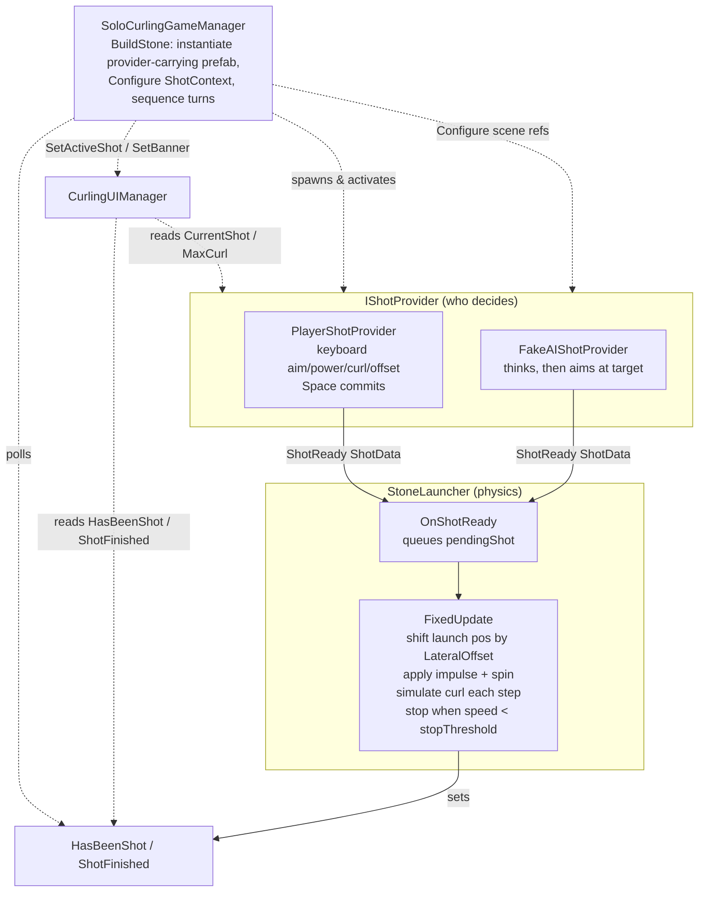
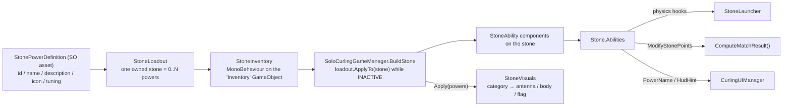

# CurlingRoundScript — Architecture Overview

This folder holds the scripts that drive a solo curling round: aiming and throwing a
stone, its sliding/curl physics, turn sequencing, and the on-screen HUD.

The defining idea of this branch (`feature/stone-lauch-abstracted`) is that **a throw is
decoupled from who decides it**. The old monolithic `CurlingStoneController` has been split
into pieces connected by a single event, so the human player and an AI can drive the *exact
same* launcher without it knowing which is which. Both game modes spawn their stones from
**provider-carrying prefabs**, so switching in a real AI is a prefab swap, not a code change.

---

## The shot abstraction (the heart of the branch)

A throw is split along one clean seam:

| Concern | Type | Role |
| --- | --- | --- |
| **Who decides a shot** | [`IShotProvider`](Shooting/IShotProvider.cs) implementations | Compose a shot, then announce it |
| **The shot itself** | [`ShotData`](Shooting/ShotData.cs) | Immutable value describing one throw |
| **What the stone does with it** | [`StoneLauncher`](Shooting/StoneLauncher.cs) | Applies physics — nothing else |

### The seam: `IShotProvider`

```csharp
event Action<ShotData> ShotReady;   // raised exactly ONCE when the shot is committed
ShotData CurrentShot { get; }       // the live, in-progress shot — for HUD preview
float MaxCurl { get; }              // max curl magnitude, so the HUD can scale its gauge
float MaxLateral { get; }           // max lateral-offset magnitude, likewise
void Rearm();                       // re-arm to accept a fresh shot on reset
```

A provider spends several frames (human) or a "thinking" delay (AI) building a shot, then
raises `ShotReady` once. `StoneLauncher` subscribes and executes it. Crucially, the launcher
stores its provider as a plain `MonoBehaviour shotProviderSource` and casts it to
`IShotProvider` at runtime — so **the launcher never names a concrete provider type**, and any
provider can be wired in from the inspector on the prefab.

### Injecting scene context: `IShotContextReceiver`

A prefab can't bake in scene references (what to aim at, the shared aim arrow). So the manager
hands those to a freshly spawned provider through a second, optional seam
([`IShotContextReceiver`](Shooting/IShotContextReceiver.cs)):

```csharp
void Configure(ShotContext context);   // context = { Transform HouseCenter; GameObject AimArrow; }
```

The AI takes `HouseCenter` as its aim target; the player takes the `AimArrow`. The manager calls
`Configure` **through the interface**, so it injects context without naming a concrete provider
type either. Providers that don't need context simply don't implement it.

### `ShotData`

An immutable `readonly struct` — the only thing that ever crosses the launch seam:

- `Direction` — normalized world-space aim (the constructor normalizes defensively, falling
  back to `Vector3.forward` for a near-zero vector, so callers can pass a raw
  `target − position`).
- `Power` — launch impulse magnitude.
- `Curl` — signed: **negative = curl left, positive = curl right** relative to travel.
- `LateralOffset` — signed sideways shift of the *launch position*, in world meters along the
  sheet's right axis (same sign convention: **negative = left, positive = right**). `Direction`
  is deliberately unaffected, so an offset **parallel-translates** the trajectory instead of
  rotating it — the real-curling "move on the hack", and a different tool from the aim angle.
  Defaulted in the constructor, so three-argument callers still compile.

---

## Control flow



**In one sentence:** a provider raises `ShotReady(ShotData)` → `StoneLauncher.OnShotReady`
queues it → the next `FixedUpdate` shifts the stone sideways by `LateralOffset` and applies the
impulse + pre-shot spin, then bends the velocity heading a little each physics step (the curl)
until speed drops below `stopThreshold`, flipping `ShotFinished` to true.

---

## Directory map

```
CurlingRoundScript/
├── Shooting/                     ← the shot abstraction
│   ├── ShotData.cs               immutable description of one throw
│   ├── IShotProvider.cs          launch seam: ShotReady / CurrentShot / MaxCurl / Rearm
│   ├── IShotContextReceiver.cs   context seam: Configure(ShotContext) for scene refs
│   ├── PlayerShotProvider.cs     human input half (keyboard → ShotData)
│   ├── StoneLauncher.cs          physics half (ShotData → impulse, curl, stop)
│   ├── Stone.cs                  the stone entity: side, phase, Rigidbody, powers, scoring
│   ├── StoneAbility.cs           base class for a power (physics hooks + scoring hook)
│   ├── StoneVisuals.cs           hangs each power's art on the socket its category dictates
│   ├── MatchEvents.cs            static event hub for match milestones
│   └── Abilities/                ← the powers themselves
│       ├── HeavyStoneAbility.cs      x2 mass, launch speed preserved
│       ├── StoppableStoneAbility.cs  brake mid-slide on a key press
│       ├── DoubleScoreAbility.cs     counts double when it scores
│       └── ExtraPowerAbility.cs      minimal sample / reference power
├── Inventory/                    ← what the player owns (see "Special stones" below)
│   ├── StonePowerDefinition.cs   abstract SO: catalogue entry + AttachTo(stone)
│   ├── PowerCategory.cs          Activated / PassiveSelf / PassiveOther — picks the visual channel
│   ├── StoneLoadout.cs           one owned stone = name + list of powers
│   ├── StoneInventory.cs         the "Inventory" GameObject; the player's stones
│   └── Definitions/              one SO subclass per power (Heavy / Stoppable / DoubleScore)
├── AIShotProviderTemp/           ← throwaway demo, meant to be replaced
│   └── FakeAIShotProvider.cs     a dumb AI proving the seams work
├── SoloCurlingGameManager.cs     orchestrator: modes, prefab spawning, turns, scoring
├── CurlingUIManager.cs           single HUD authority (TextMeshPro)
├── CameraSwitcher.cs             independent: cycle cameras with Tab
└── PlayerTagAssigner.cs          independent: assign a tag in edit/play mode
```

---

## Per-script responsibilities

### The shooting seam (`Shooting/` + `AIShotProviderTemp/`)

**[`ShotData`](Shooting/ShotData.cs)** — immutable `readonly struct` (Direction, Power,
Curl, LateralOffset). Pure data, source-agnostic; produced by any provider, consumed by the
launcher and read by the HUD. Depends on nothing but `UnityEngine`.

**[`IShotProvider`](Shooting/IShotProvider.cs)** — the interface every shot source implements:
the `ShotReady` event, the `CurrentShot` preview getter, `MaxCurl` / `MaxLateral` (so the HUD can
scale its curl and offset gauges without knowing the concrete type), and `Rearm()`. This is the
only thing `StoneLauncher` and `CurlingUIManager` know about a shot source.

**[`IShotContextReceiver`](Shooting/IShotContextReceiver.cs)** — an optional second interface
plus the `ShotContext` struct. Lets the manager pass per-turn scene references (house center,
aim arrow) into a provider without naming a concrete type. Implemented by both providers today.

**[`PlayerShotProvider`](Shooting/PlayerShotProvider.cs)** — the human input half
(`MonoBehaviour, IShotProvider, IShotContextReceiver`). Each `Update` reads the keyboard (← →
aim, ↑ ↓ power, Q/E curl, A/D lateral offset) and updates the aim-preview arrow; **Space** commits the shot via
`CommitShot()`, which raises `ShotReady`. An `armed` flag flips off the instant Space is pressed
so a shot can't fire twice until `Rearm()`. `Configure` receives the aim arrow the manager spawns
for this stone. Knows nothing about physics — including the lateral offset: it only *composes* the
value, and the launcher is what actually moves the stone. (The arrow needs no extra code to follow:
`UpdateAimArrow()` anchors it to `transform.position`, which the launcher has already shifted.)

**[`FakeAIShotProvider`](AIShotProviderTemp/FakeAIShotProvider.cs)** — a **temporary,
throwaway** demo (`MonoBehaviour, IShotProvider, IShotContextReceiver`), explicitly *not* the
real `AIStoneController` (which lives outside this folder and is untouched). `OnEnable` starts
the `ThinkThenShoot()` coroutine — the manager only activates the stone on the AI's turn, so
enabling *is* the cue to start deliberating. After `thinkDelaySeconds` it aims flat at its
`target` (injected via `Configure` as the house center), applies a configurable, optionally
jittered power/curl/lateral offset, and raises `ShotReady`. Its whole point is to prove a non-human
source drops into the same launcher and prefab pipeline with zero launcher/manager changes.
Note it aims from its **un-shifted** spawn position on purpose: re-aiming from the offset launch
point would cancel the offset out, so aiming from the nominal spawn makes `baseLateral`
parallel-translate the AI's path exactly as the player's A/D does.

**[`StoneLauncher`](Shooting/StoneLauncher.cs)** — the physics half
(`[RequireComponent(typeof(Rigidbody))]`). In `OnEnable` it casts `shotProviderSource` to
`IShotProvider` (logging an error if the cast fails) and subscribes to `ShotReady`;
`OnDisable` unsubscribes. `OnShotReady` stashes the shot and defers it to `FixedUpdate`, where the
launch position is shifted by `LateralOffset`, the impulse and one-shot spin are applied, and then
curl is simulated until the stone stops. Exposes `HasBeenShot` / `ShotFinished` (polled by the
manager and UI) and `ResetStone()`, which restores the start pose and calls `provider?.Rearm()`.

While unshot it also *previews* the live shot each `FixedUpdate` — spinning the stone by
`CurrentShot.Curl` and sliding it sideways to `CurrentShot.LateralOffset` — so the human sees the
throw take shape. The offset is written straight to `rb.position` (relative to the cached,
un-shifted `startPosition`) rather than applied as a force. Keeping `startPosition` un-shifted is
what lets `ResetStone()` and `Rearm()` clear an offset cleanly.

> **Why `PreShotConstraints` freezes only Y.** An unshot stone used to be held by
> `RigidbodyConstraints.FreezePosition`, but the solver treats a frozen linear axis as
> authoritative and **reverts any `rb.position` write on it** — which silently swallowed the
> lateral preview, making the offset appear only at release (the launch path swaps the
> constraints out first, so its write survived). X/Z are therefore left free and pinned in code
> instead: the pre-shot branch rewrites `rb.position` and zeroes the velocity every step, which
> holds the stone just as firmly while still letting the preview move it.

### Orchestration & UI

**[`SoloCurlingGameManager`](SoloCurlingGameManager.cs)** — the orchestrator, with two modes
(`GameMode { TestDrop, Match }`). **Both modes spawn every stone from a prefab** via `BuildStone`;
the pre-placed scene `stone` is disabled and never launched.

- **`BuildStone(isAI, out launcher, out provider)`** is the shared spawn path. It instantiates
  the right prefab (`playerStonePrefab` / `aiStonePrefab`), reads the `StoneLauncher` and its
  wired `IShotProvider` off the prefab, spawns a per-stone aim-arrow instance for a human, and
  calls `Configure(new ShotContext(houseCenter, aimArrow))` — **without naming a concrete
  provider type**. A misconfigured prefab logs a clear error and the turn is skipped rather than
  crashing. (Tuning now lives on the prefab; there is no runtime `AddComponent` or component
  stripping.)
- **TestDrop** (original showcase): `SpawnTestPlayerStone` builds one player stone (tracked in
  `playerLauncher`) and `SpawnEnemyStones` drops `enemyStoneCount` plain obstacle stones from
  `enemyStonePrefab`; `ComputeScore()` gives +1 if the player is closest, else −1 per closer
  enemy. **R** resets.
- **Match** (temp turn-based round): `RunMatch()` loops → `RunTurn(isAI)` per throw (`i % 2 == 0`
  is the AI, so the **AI throws first**), `stonesPerSide * 2` throws total → `ComputeMatchResult()`
  (standard curling end scoring, excluding stones that fell off the sheet) → banner → **R** to
  replay. Recovery: **N** (`forceNextTurnKey`) force-skips a stuck turn; `FixedUpdate` freezes
  stones that fall below `killY` and snaps slow creepers to a stop. `DestroyStoneAndArrow` cleans
  up a stone together with its aim-arrow instance.

**[`CurlingUIManager`](CurlingUIManager.cs)** — the single HUD authority, rendering both modes
through one `TMP_Text infoText`. It's driven by an "active shot" (a `StoneLauncher` + optional
provider) plus an optional banner line, tracked internally as an **`IShotProvider`** so any
provider works. `Update` picks the state from `HasBeenShot`/`ShotFinished`: live aiming HUD
(power / curl bar / offset bar / aim, read from `CurrentShot`, `MaxCurl` and `MaxLateral`, both
gauges drawn by the shared `SignedBar` helper), "stone is sliding", a banner, or the
test-mode result panel. `SetActiveShot(stone, provider)` reassigns it each turn — a **null
provider suppresses the aiming HUD** (used on AI turns); the serialized `provider` field is only
the inspector default for TestDrop and is not broken by the interface routing.

---

## Special stones

A "special stone" is an ordinary stone prefab with extra `StoneAbility` components bolted on **at
spawn time**. Nothing about a power is baked into a prefab, so the same two prefabs
(`playerStonePrefab` / `aiStonePrefab`) serve every combination.

### The chain



### Two kinds of hook

`StoneAbility` now covers both halves of what a power can do:

| Family | Hooks | Fired by |
| --- | --- | --- |
| **Physics** | `OnLaunch` / `OnSlideTick` / `OnStopped` / `OnStoneCollision` | `StoneLauncher`, every physics step |
| **Scoring** | `ModifyStonePoints(int)` | `Stone.ScorePoints()`, when the end is counted |

Both are **chained across every ability on the stone**, which is what makes powers stack — two
Double Score components give ×4 because the point value is threaded through both.

### The three powers

- **Heavy** (`HeavyStoneAbility`) — multiplies mass by 2 in `Awake`, so it wins collisions and
  resists being knocked out. Because an impulse gives Δv = impulse / mass, `OnLaunch` tops the
  launch impulse up by the same factor, so the throw still travels its normal distance: a pure
  momentum upgrade rather than a throw that suddenly falls short.
- **Stoppable** (`StoppableStoneAbility`) — press **S** mid-slide to halt the stone
  (`usesPerThrow` brakes per throw, one by default; `brakeDeceleration > 0` for a skid instead of a
  dead stop). The key is latched in `Update` and consumed in `OnSlideTick`, because a
  `wasPressedThisFrame` read inside FixedUpdate is missed or double-counted. It never touches the
  launcher: once the velocity is zero, the launcher's own stop-detection ends the shot normally.
- **Double Score** (`DoubleScoreAbility`) — overrides only `ModifyStonePoints`. It applies to a
  stone that *already* counts; which stones count stays entirely in `ComputeMatchResult()`.

> **Reading the shot inside a power.** `launcher.Body.linearVelocity` is still **zero** in
> `OnLaunch` — `AddForce` is only integrated by the physics step at the end of that FixedUpdate.
> Use `launcher.ActiveShot` (Direction / Power / Curl / LateralOffset) instead. Both
> `HeavyStoneAbility` and the `ExtraPowerAbility` sample show the pattern.

### The catalogue and the inventory

A power is authored as a **ScriptableObject asset** (`Create ▸ Curling ▸ Powers ▸ …`) carrying its
identity, presentation and tuning, plus an `AttachTo(GameObject)` that adds the matching component
and copies the tuning across. Adding a fourth power is *one ability class + one definition subclass
+ one asset* — no enum to extend and no factory switch to update, and story mode's shop will read
name / description / icon straight off the same asset instead of a parallel table.

`StoneInventory` (on an "Inventory" GameObject, wired into the manager's `playerStoneInventory`)
holds the player's `StoneLoadout`s. In a match the player's throws consume the list **in order** —
throw 0 → stone `[0]`, and a throw past the end of the list gets an ordinary stone, so a missing or
short inventory never breaks a round. TestDrop mode always uses stone `[0]`, which makes it a quick
way to try one power. `AddStone` / `AddPower` / `RemovePower` / `InventoryChanged` are the runtime
API story mode will drive.

### The visual language

A player must be able to read a stone's powers off its silhouette, and that has to keep working as
powers accumulate — so the mapping is a **fixed grammar**, not a per-power art choice. A power's
`PowerCategory` decides *which channel* its art uses; the power itself supplies the *mesh* in that
channel. Every activated power wears an antenna, but no two antennas look alike.

| Category | Meaning | Channel |
| --- | --- | --- |
| `Activated` | the player triggers it (Stoppable) | **antenna** above the handle |
| `PassiveSelf` | buffs the stone itself (Heavy) | the **stone body** is swapped |
| `PassiveOther` | affects scoring / other stones (Double Score) | small **flag** on the rim |

The mapping lives in exactly one method — `StoneVisuals.SocketFor(PowerCategory)` — so changing the
language is a one-line edit and no power can drift out of it. `Category` is an abstract property on
each definition subclass rather than a serialized field, so it cannot be misconfigured per asset.

`StoneVisuals` sits on the stone prefab root and is handed the **whole power set** in one call from
`StoneLoadout.ApplyTo`. That is what lets it own the two rules that need global knowledge: stacked
antennas/flags are spread sideways (and kept centred) instead of z-fighting, and only the **first**
`PassiveSelf` power swaps the body — a stone cannot wear two, and a second logs a warning naming both.

> **A body swap never touches physics.** The `stone` child carries the convex MeshCollider *and* the
> ice physic material — it is the collision body, not just a mesh. So a body power disables that
> renderer (`bodyRenderer.enabled = false`, **not** `SetActive(false)`, which would take the collider
> with it) and parents a replacement mesh alongside. Every stone therefore collides identically
> whatever it carries, which keeps the physics fair and predictable. **Body prefabs must contain no
> collider.** A stone that starts bouncing oddly means one slipped in.

> **Scale.** The stone root is scaled to `0.06`, so anything parented under it inherits that — the
> same trap the aim arrow hit. Each socket carries a `localScale` of ≈ `16.667` (1 / 0.06) so
> attachment prefabs can be authored at real metre scale.

Art is only ever a prefab reference (`StonePowerDefinition.visualPrefab`), so a primitive placeholder
becomes a modelled Blender mesh by swapping one field — no code change. A power with no art still
works mechanically and still shows in the HUD; it just logs one warning.

### Timing contract (the one thing to not break)

Powers **must** be attached while the stone GameObject is still inactive. `BuildStone` already
instantiates with `SetActive(false)`, wires the provider and context, and only then activates —
`loadout.ApplyTo(go)` goes inside that window, so the components exist before `Stone.Awake` caches
them into `Stone.Abilities` and before `StoneLauncher` starts firing hooks.

### Not yet wired to story mode

`StoneInventory` is deliberately independent of `CampainManager`: that manager's inventory is a
`Dictionary<string,int>` of item id → quantity, which cannot express "stone #2 carries powers A and
B". Bridging them is a story-mode task, and `StonePowerDefinition.powerId` is the key it will use.

---

### Independent utilities

**[`CameraSwitcher`](CameraSwitcher.cs)** — cycles a `Camera[]` with **Tab** (configurable
`switchKey`), enabling one at a time. Also exposes `SwitchTo(int)` for other scripts. No
dependency on the shot system.

**[`PlayerTagAssigner`](PlayerTagAssigner.cs)** — `[ExecuteAlways]` helper that assigns a
configurable `playerTag` to its GameObject in both edit and play mode (via `OnValidate`,
`OnEnable`, `Awake`), warning once if the tag isn't defined. Unrelated to the shot flow.

---

## How a turn plays out (Match mode)

1. `RunMatch()` clears the sheet and loops `stonesPerSide * 2` turns.
2. `RunTurn(isAI)` calls `BuildStone`, which instantiates the provider-carrying prefab, reads its
   `StoneLauncher` + `IShotProvider`, and injects the `ShotContext` — everything wired *before*
   the object is activated.
3. It waits until `launcher.HasBeenShot` (the provider raised `ShotReady`) — or a forced skip.
4. Then it waits until `launcher.ShotFinished && AllMatchStonesSettled()` (with a 20 s safety
   timeout and the force-skip escape).
5. The stone is filed into `aiStones` or `playerStones` by side.
6. After all throws, `ComputeMatchResult()` scores the end, pushes the result to the UI
   banner, and waits for **R** to replay.

---

## Patterns & conventions

- **Two interface seams:** `IShotProvider` (a C# `event Action<ShotData>`, not a `UnityEvent`)
  for who-decides-vs-physics, and `IShotContextReceiver` for injecting scene references — both
  keep the manager and launcher from naming concrete provider types.
- **Prefab-authored providers:** each stone prefab carries exactly one `StoneLauncher` + one
  `IShotProvider` with `shotProviderSource` wired, so a new provider (e.g. a real AI) is a prefab,
  not a manager edit. Tuning lives on the prefab.
- **Interface polymorphism via `shotProviderSource as IShotProvider`** — the launcher is wired to
  a `MonoBehaviour` and never names a concrete provider.
- **Polling of public getters** (`HasBeenShot`, `ShotFinished`, `CurrentShot`, `MaxCurl`,
  `GetLastScore`) for state the manager and UI observe.
- **Coroutines** (`RunMatch`, `RunTurn`, `ThinkThenShoot`) with `WaitUntil` / `WaitForSeconds`
  for turn and think sequencing.
- **New Input System** throughout (`Keyboard.current`).
- **No singletons** — the manager finds the UI once via `FindFirstObjectByType<CurlingUIManager>()`
  as a fallback and otherwise passes references explicitly.

---

## Extension points (foundations for later work)

Four seams exist so the planned features can be built without touching the launch pipeline:

- **`Stone` entity** ([Shooting/Stone.cs](Shooting/Stone.cs)) — identity (`Side`) + lifecycle
  (`Phase`: Idle/Sliding/Stopped/Lost) + cached `Body` + `Abilities` (the stone's powers) +
  `ScorePoints()`. The thing systems hang off of instead of raw GameObjects.
- **Stackable powers** ([Shooting/StoneAbility.cs](Shooting/StoneAbility.cs)) — subclass
  `StoneAbility` and override any of `OnLaunch` / `OnSlideTick` / `OnStopped` / `OnStoneCollision`
  (physics) or `ModifyStonePoints` (scoring). Every hook is fired on **every** `StoneAbility` on the
  stone, so powers **stack** by simply adding more components. See
  [Abilities/](Shooting/Abilities/) for the three real powers and the minimal
  [ExtraPowerAbility.cs](Shooting/Abilities/ExtraPowerAbility.cs) sample.
- **Power catalogue + inventory** ([Inventory/](Inventory/)) — a `StonePowerDefinition` asset per
  power, `StoneLoadout` for one owned stone, `StoneInventory` for the collection. See the
  "Special stones" section above. This is where story mode (buying / upgrading) plugs in.
- **Match events** ([Shooting/MatchEvents.cs](Shooting/MatchEvents.cs)) — a static hub raising
  `TurnStarted` / `StoneReleased` / `StoneStopped` / `StoneLost` / `EndScored`. Anything (a power,
  the UI, audio) can subscribe in `OnEnable` and unsubscribe in `OnDisable` without wiring a
  manager reference. `SoloCurlingGameManager` raises them at the turn lifecycle points.

> **Note:** the real AI, `AIStoneController`, lives *outside* this folder and is untouched.
> Everything under `AIShotProviderTemp/` is a temporary demo and is meant to be deleted or
> replaced once a real AI provider implements `IShotProvider` (and, if it needs the house center,
> `IShotContextReceiver`).
